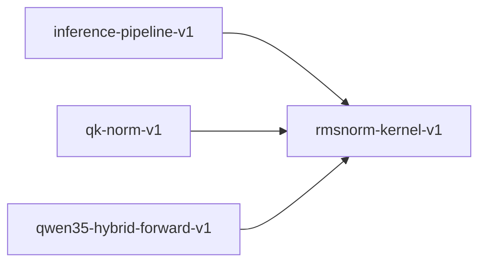

# rmsnorm-kernel-v1

**Version:** 1.0.0

RMSNorm kernel — root mean square layer normalization

## References

- Zhang & Sennrich (2019) Root Mean Square Layer Normalization
- Touvron et al. (2023) Llama 2: Open Foundation and Fine-Tuned Chat Models

## Dependency Graph

```mermaid
graph LR
    inference_pipeline_v1["inference-pipeline-v1"] --> rmsnorm_kernel_v1["rmsnorm-kernel-v1"]
    qk_norm_v1["qk-norm-v1"] --> rmsnorm_kernel_v1["rmsnorm-kernel-v1"]
    qwen35_hybrid_forward_v1["qwen35-hybrid-forward-v1"] --> rmsnorm_kernel_v1["rmsnorm-kernel-v1"]
```

## Equations

### rmsnorm

$$
RMSNorm(x)_i = (x_i / RMS(x)) · \gamma_i where RMS(x) = √(\sum x_i² / n + \varepsilon)
$$

**Domain:** $x \in \mathbb{R}^n, \gamma \in \mathbb{R}^n, \varepsilon > 0$

**Codomain:** $\mathbb{R}^n$

**Invariants:**

- $‖RMSNorm(x)‖² / n \approx ‖\gamma‖² / n (scale preservation)$
- $RMSNorm(\alpha·x) = sign(\alpha) · RMSNorm(x) · \gamma (scale invariance)$

## Proof Obligations

| # | Type | Property | Formal |
|---|------|----------|--------|
| 1 | precondition | Input and weight vectors finite, same length, epsilon positive | $len(x) = len(\gamma) ∧ \varepsilon > 0 ∧ \forall i: isFinite(x_i) ∧ isFinite(\gamma_i)$ |
| 2 | postcondition | Output same length as input, all elements finite | $len(out) = len(x) ∧ \forall i: isFinite(out_i)$ |
| 3 | frame | Input vector, weight vector, and epsilon unchanged | $modifies(output) ∧ preserves(x, \gamma, \varepsilon)$ |
| 4 | invariant | Output is finite | $\|RMSNorm(x)_i\| < ∞ for all i when \varepsilon > 0$ |
| 5 | invariant | Scale invariance | $RMSNorm(\alpha·x) = sign(\alpha) · RMSNorm(x) for \alpha \neq 0$ |
| 6 | bound | RMS denominator is positive | $RMS(x) > 0 when \varepsilon > 0$ |
| 7 | equivalence | SIMD matches scalar within ULP |  |
| 8 | idempotency | Normalized RMS ≈ 1 | $RMS(RMSNorm(x)/\gamma) \approx 1 when \gamma = 1$ |

## Kernel Phases

1. **sum_squares**: Compute Σ x_i² — *sum >= 0*
2. **compute_rms**: Compute √(sum/n + ε) — *rms > 0 when ε > 0*
3. **normalize_scale**: Compute x_i / rms * γ_i — *output finite when rms > 0*

## SIMD Dispatch

| Kernel | ISA | Target |
|--------|-----|--------|
| rmsnorm | avx2 | `rmsnorm_avx2` |
| rmsnorm | ptx | `rmsnorm_ptx` |
| rmsnorm | scalar | `rmsnorm_scalar` |

## Falsification Tests

| ID | Rule | Prediction | If Fails |
|----|------|------------|----------|
| FALSIFY-RN-001 | Finiteness | RMSNorm(x) is finite for all finite x when ε > 0 | Division by zero when ε too small |
| FALSIFY-RN-002 | Scale invariance | RMSNorm(α·x) ≈ sign(α)·RMSNorm(x) for α ≠ 0 | Epsilon not scale-invariant in implementation |
| FALSIFY-RN-003 | SIMD equivalence | \|rmsnorm_avx2(x) - rmsnorm_scalar(x)\| < 4 ULP | SIMD reduction ordering differs |
| FALSIFY-RN-004 | Zero vector | RMSNorm(0) = 0 (output is zero vector) | NaN from 0/ε edge case |
| FALSIFY-RN-005 | Unit γ normalized RMS | RMS(RMSNorm(x)/1) ≈ 1 for γ = [1,1,...,1] | Normalization not producing unit RMS |
| FALSIFY-RN-006 | Precondition - mismatched lengths | rmsnorm(x, γ) panics or returns Err when len(x) ≠ len(γ) | Missing length validation |
| FALSIFY-RN-007 | Frame condition | Input x and weight γ byte-identical before and after rmsnorm | Kernel corrupts input buffer |
| FALSIFY-RN-008 | Postcondition - output length | len(rmsnorm(x, γ, ε)) = len(x) | Output buffer allocation mismatch |

## Kani Harnesses

| ID | Obligation | Bound | Strategy |
|----|------------|-------|----------|
| KANI-RN-001 | RN-INV-001 | 16 | exhaustive |
| KANI-RN-002 | RN-BND-001 | 16 | exhaustive |
| KANI-RMSNOR-003 | Input and weight vectors finite, same length, epsilon positive | 8 | exhaustive |
| KANI-RMSNOR-004 | Output same length as input, all elements finite | 8 | exhaustive |
| KANI-RMSNOR-005 | Input vector, weight vector, and epsilon unchanged | 8 | exhaustive |
| KANI-RMSNOR-006 | Output is finite | 8 | exhaustive |
| KANI-RMSNOR-007 | Scale invariance | 8 | exhaustive |
| KANI-RMSNOR-008 | RMS denominator is positive | 8 | exhaustive |
| KANI-RMSNOR-009 | SIMD matches scalar within ULP | 8 | exhaustive |
| KANI-RMSNOR-010 | Normalized RMS ≈ 1 | 8 | exhaustive |

## QA Gate

**RMSNorm Contract** (F-RN-001)

Root mean square normalization quality gate

**Checks:** finiteness, scale_invariance, simd_equivalence

**Pass criteria:** All 8 falsification tests pass + Kani harnesses verify

