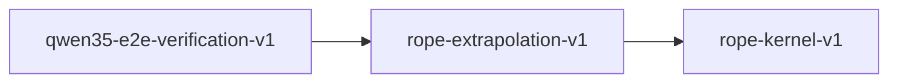

# rope-extrapolation-v1

**Version:** 1.0.0

RoPE extrapolation — NTK-aware scaling and YaRN interpolation for long-context inference

## References

- Su et al. (2021) RoFormer: Enhanced Transformer with Rotary Position Embedding
- bloc97 (2023) NTK-Aware Scaled RoPE
- Peng et al. (2023) YaRN: Efficient Context Window Extension of Large Language Models
- Qwen3.5 Technical Report — extended context via NTK-scaled RoPE

## Dependencies

- [rope-kernel-v1](rope-kernel-v1.md)

## Dependency Graph

## Equations

### base_frequency

$$
freq_i = theta^(-2i/d) for i in [0, d/2)
$$

**Domain:** $theta = rope_base (default 10000), d = head_dim$

**Invariants:**

- $freq_0 = 1.0$
- $Strictly decreasing in i$
- $All frequencies positive$

### linear_interpolation

$$
freq'_i = freq_i / scale where scale = L_new / L_orig
$$

**Domain:** $Naive position interpolation (PI)$

**Invariants:**

- $freq'_i < freq_i when scale > 1$
- $Frequency ratios preserved: freq'_i / freq'_j = freq_i / freq_j$

### ntk_scaled_base

$$
theta' = theta * (alpha * L_new / L_orig)^(d / (d - 2))
$$

**Domain:** $alpha = scaling factor, L_new = target length, L_orig = trained length$

**Invariants:**

- $theta' > theta when L_new > L_orig$
- $theta' = theta when L_new = L_orig$
- $All derived frequencies remain positive$

### rotation_matrix

$$
R(pos, i) = [[cos(pos*freq_i), -sin(pos*freq_i)], [sin(pos*freq_i), cos(pos*freq_i)]]
$$

**Domain:** $2x2 rotation block for dimension pair (2i, 2i+1)$

**Invariants:**

- $R is orthogonal: R^T R = I$
- $det(R) = 1 (proper rotation)$
- $R(0, i) = I (identity at position 0)$

### yarn_mixed_frequency

$$
freq'_i = (1 - s_i) * freq_i / scale + s_i * freq_i
$$

**Domain:** $Per-dimension interpolation mix$

**Invariants:**

- $Low frequencies (small i) get interpolated$
- $High frequencies (large i) stay unchanged$
- $All freq'_i > 0$

### yarn_ramp

$$
s(r) = (r - lo) / (hi - lo) clamped to [0, 1]
$$

**Domain:** $r = wavelength ratio, lo/hi = interpolation bounds$

**Invariants:**

- $s(r) = 0 for r <= lo$
- $s(r) = 1 for r >= hi$
- $Monotonically non-decreasing$

## Proof Obligations

| # | Type | Property | Formal |
|---|------|----------|--------|
| 1 | invariant | Base frequencies positive and decreasing | $\forall i: freq_i > 0 ∧ (i < d/2-1 \to freq_i > freq_{i+1})$ |
| 2 | invariant | NTK identity at original length | $L_new = L_orig \to theta' = theta$ |
| 3 | monotonicity | NTK base grows with target length | $L_new > L_orig \to theta' > theta$ |
| 4 | invariant | Linear interpolation preserves ratios | $freq'_i / freq'_j = freq_i / freq_j$ |
| 5 | bound | YaRN ramp bounded [0,1] | $\forall r: 0 <= s(r) <= 1$ |
| 6 | monotonicity | YaRN ramp non-decreasing | $r1 < r2 \to s(r1) <= s(r2)$ |
| 7 | invariant | Rotation matrix orthogonality | $\forall pos,i: R(pos,i)^T R(pos,i) = I (tolerance 1e-12)$ |
| 8 | idempotency | Rotation at position 0 is identity | $R(0, i) = I for all i$ |

## Falsification Tests

| ID | Rule | Prediction | If Fails |
|----|------|------------|----------|
| FALSIFY-REXT-001 | Base frequency formula | freq_0 = 1.0 and strictly decreasing | Exponent sign or base computation error |
| FALSIFY-REXT-002 | NTK scaling identity | theta unchanged when L_new = L_orig | Off-by-one in NTK exponent |
| FALSIFY-REXT-003 | Linear interpolation ratio preservation | freq'_i / freq'_j = freq_i / freq_j | Per-dimension scaling not uniform |
| FALSIFY-REXT-004 | YaRN ramp clamping | Output in [0,1] for all inputs | Missing clamp in ramp function |
| FALSIFY-REXT-005 | Rotation orthogonality | R^T R = I within 1e-12 | sin/cos numerical error or formula bug |
| FALSIFY-REXT-006 | Position 0 identity | cos(0) = 1, sin(0) = 0 | Off-by-one position indexing |
| FALSIFY-REXT-007 | NTK base monotonicity | Larger target length => larger base | Exponent formula inverted in NTK scaling |
| FALSIFY-REXT-008 | YaRN ramp non-decreasing | ramp(r1) <= ramp(r2) for r1 < r2 | Ramp function not monotonic |

## Kani Harnesses

| ID | Obligation | Bound | Strategy |
|----|------------|-------|----------|
| KANI-REXT-001 | REXT-INV-001 | 64 | bounded_int |
| KANI-REXT-002 | REXT-BND-001 | 32 | exhaustive |

## QA Gate

**RoPE Extrapolation Contract** (F-REXT-001)

NTK-aware scaling and YaRN interpolation quality gate

**Checks:** base_frequency, ntk_scaled_base, linear_interpolation, yarn_ramp, yarn_mixed_frequency, rotation_matrix

**Pass criteria:** All 8 falsification tests pass

