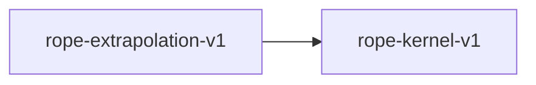

# rope-kernel-v1

**Version:** 1.0.0

RoPE kernel — rotary position embeddings

## References

- Su et al. (2021) RoFormer: Enhanced Transformer with Rotary Position Embedding

## Dependency Graph

## Equations

### rope

$$
RoPE(x, m)_{2k} = x_{2k}·cos(m\theta_k) - x_{2k+1}·sin(m\theta_k), RoPE(x, m)_{2k+1} = x_{2k}·sin(m\theta_k) + x_{2k+1}·cos(m\theta_k)
$$

**Domain:** $x \in \mathbb{R}^d, m \in ℕ, \theta_k = 10000^(-2k/d)$

**Codomain:** $\mathbb{R}^d$

**Invariants:**

- $‖RoPE(x, m)‖ = ‖x‖ (norm preservation)$
- $⟨RoPE(q, m), RoPE(k, n)⟩ depends only on q, k, m-n (relative position)$

## Proof Obligations

| # | Type | Property | Formal |
|---|------|----------|--------|
| 1 | invariant | Norm preservation | $\|‖RoPE(x, m)‖ - ‖x‖\| < \varepsilon$ |
| 2 | invariant | Relative position encoding | $⟨RoPE(q, m), RoPE(k, n)⟩ = f(q, k, m-n)$ |
| 3 | equivalence | SIMD matches scalar |  |
| 4 | bound | Output bounded by input norm | $‖RoPE(x, m)‖ \leq ‖x‖ + \varepsilon$ |

## Kernel Phases

1. **compute_freqs**: Compute θ_k = 10000^(-2k/d) for each dimension pair — *θ_k > 0 for all k*
2. **compute_sincos**: Compute cos(m·θ_k) and sin(m·θ_k) — *cos²+sin² = 1 within precision*
3. **rotate_pairs**: Apply 2D rotation to each (x_{2k}, x_{2k+1}) pair — *pair norm preserved*

## Falsification Tests

| ID | Rule | Prediction | If Fails |
|----|------|------------|----------|
| FALSIFY-RP-001 | Norm preservation | ‖RoPE(x, m)‖ ≈ ‖x‖ for random x, m | sin/cos computation error or pair indexing bug |
| FALSIFY-RP-002 | Relative position | dot(RoPE(q,m), RoPE(k,n)) = dot(RoPE(q,0), RoPE(k,n-m)) | Incorrect frequency computation |
| FALSIFY-RP-003 | SIMD equivalence | \|rope_avx2(x) - rope_scalar(x)\| < 4 ULP | SIMD sincos approximation differs |
| FALSIFY-RP-004 | Zero position | RoPE(x, 0) = x (identity at position 0) | Off-by-one in position indexing |

## Kani Harnesses

| ID | Obligation | Bound | Strategy |
|----|------------|-------|----------|
| KANI-RP-001 | RP-INV-001 | 4 | stub_float |

## QA Gate

**RoPE Contract** (F-RP-001)

**Checks:** norm_preservation, relative_position

**Pass criteria:** All 4 falsification tests pass

