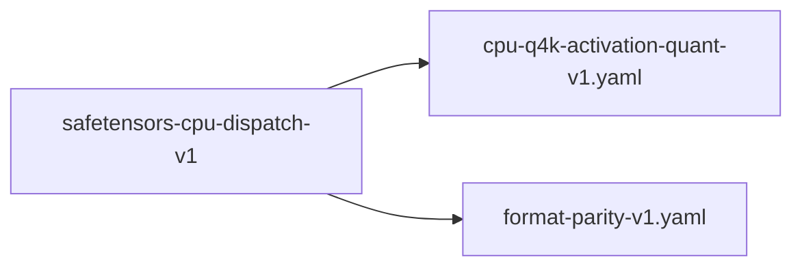

# safetensors-cpu-dispatch-v1

**Version:** 1.0.0

SafeTensors CPU path must dispatch to quantized kernels after runtime Q4K conversion

## References

- qwen-coder-deploy bench-results-v2: SafeTensors CPU 6.0 vs GGUF CPU 9.5 tok/s (36% gap)
- realizar matmul_fused.rs — dispatch logic for quantized vs float paths
- realizar float16_matmul — F32 fallback path (suspected regression)

## Dependencies

- [cpu-q4k-activation-quant-v1.yaml](cpu-q4k-activation-quant-v1.yaml.md)
- [format-parity-v1.yaml](format-parity-v1.yaml.md)

## Dependency Graph



## Equations

### format_parity

```
After SafeTensors → Q4K runtime conversion:
  tensor_type(converted) == Q4_K
  matmul_dispatch(converted, acts) → fused_q4k_parallel_matvec

If dispatch falls through to float path:
  float16_matmul operates on F32 weights (4× more memory traffic)
  throughput_loss = sizeof(f32) / sizeof(q4k_effective) ≈ 4-8×

Measured gap: 6.0 / 9.5 = 0.63 (37% slower)
Expected if F32 fallback: 9.5 / 4 ≈ 2.4 (consistent with partial fallback)

```

**Domain:** $SafeTensors \to Q4K conversion, CPU inference$

**Invariants:**

- $All matmuls after conversion use Q4K kernel, not F32$
- $SafeTensors CPU throughput within 10\% of GGUF CPU$

## Proof Obligations

| # | Type | Property | Formal |
|---|------|----------|--------|
| 1 | equivalence | SafeTensors CPU matches GGUF CPU throughput | $tok/s(SafeTensors CPU) \geq 0.9 × tok/s(GGUF CPU)$ |
| 2 | invariant | Quantized dispatch after conversion | $All weight tensors have type Q4_K after SafeTensors\to Q4K conversion$ |
| 3 | equivalence | Output parity across formats | `argmax(logits_safetensors) == argmax(logits_gguf) for same prompts` |

## Falsification Tests

| ID | Rule | Prediction | If Fails |
|----|------|------------|----------|
| FALSIFY-SD-001 | Format throughput parity | SafeTensors CPU within 10% of GGUF CPU tok/s | Dispatch falling through to F32 path |
| FALSIFY-SD-002 | Tensor type after conversion | All weight tensors report Q4_K type in /metrics endpoint | Conversion incomplete — some tensors remain F32 |
| FALSIFY-SD-003 | Output parity | 20-token greedy generation identical between SafeTensors and GGUF CPU | Conversion rounding differs from GGUF quantization |

## Kani Harnesses

| ID | Obligation | Bound | Strategy |
|----|------------|-------|----------|
| KANI-SD-001 | SafeTensors CPU matches GGUF CPU throughput | 4 | bounded_int |
| KANI-SD-002 | Quantized dispatch after conversion | 8 | bounded_int |
| KANI-SD-003 | Output parity across formats | 4 | stub_float |

## QA Gate

**SafeTensors CPU Dispatch Contract** (F-SD-001)

SafeTensors must use quantized kernels after conversion

**Checks:** format_throughput_parity, tensor_type_verification, output_parity

**Pass criteria:** All 3 falsification tests pass + throughput within 10% of GGUF

