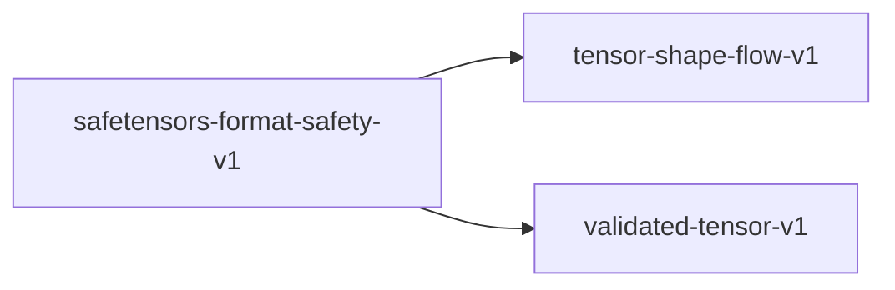

# safetensors-format-safety-v1

**Version:** 1.0.0

Safetensors binary format safety — JSON header validation, tensor offset bounds, dtype consistency, and zero-copy mmap correctness. Safetensors was designed to prevent pickle RCE but still has parsing-layer defect vectors (header size overflow, overlapping tensor regions, dtype mismatch).


## References

- Safetensors specification (huggingface/safetensors, README.md)
- CVE-2023-37470 — safetensors header injection via crafted JSON
- HuggingFace safetensors format: 8-byte LE header_size + JSON header + tensor data
- aprender/src/safetensors/ — Safetensors parser implementation

## Dependencies

- [tensor-shape-flow-v1](tensor-shape-flow-v1.md)
- [validated-tensor-v1](validated-tensor-v1.md)

## Dependency Graph



## Equations

### dtype_consistency

```
validate_dtype: (String, &[u8]) -> Result<DType, FormatError>
  dtype_str ∈ {"F16", "F32", "F64", "BF16", "I8", "I16", "I32", "I64", "U8", "BOOL"}
  dtype_size(dtype) ∈ {1, 2, 4, 8}
  tensor_bytes.len() == product(shape) * dtype_size(dtype)

```

**Domain:** $dtype string from JSON header + tensor bytes$

**Codomain:** $Result<DType, FormatError>$

**Invariants:**

- $Only known dtype strings accepted (no arbitrary types)$
- $Byte count exactly matches shape * size (no trailing/missing bytes)$
- $BF16 and F16 distinguished (different bit patterns)$

### header_size_validation

```
validate_header: &[u8] -> Result<(usize, JsonHeader), FormatError>
  header_size = u64::from_le_bytes(bytes[0..8])
  header_size < MAX_HEADER_SIZE (100MB)
  header_size + 8 <= file_size
  json_bytes = &bytes[8..8+header_size]
  header = serde_json::parse(json_bytes)?

```

**Domain:** $First bytes of a safetensors file$

**Codomain:** $Result<(header_size, parsed JSON), FormatError>$

**Invariants:**

- $header_size is validated before ANY allocation$
- $header_size + 8 <= file_size (no OOB read)$
- `header_size < MAX_HEADER_SIZE prevents memory exhaustion`
- $JSON parsing fails gracefully on malformed input$

### mmap_zero_copy

$$
mmap_tensor: (fd, offset, size) -> Result<&[u8], MmapError>
  mmap(fd, offset=data_start+begin, len=end-begin, PROT_READ)
  Result is a borrowed slice — no copy, no allocation
  Page-aligned offset for efficiency

$$

**Domain:** $File descriptor + tensor offset range$

**Codomain:** $Result<&[u8], MmapError> — borrowed, zero-copy$

**Invariants:**

- $No data copied to heap (zero-copy guarantee)$
- $mmap region does not extend beyond file$
- $Alignment to page boundary for efficient access$
- $Multiple tensors can be mmapped simultaneously$

### no_overlap_invariant

```
check_no_overlap: Vec<(begin, end)> -> Result<(), OverlapError>
  Sort regions by begin
  For adjacent pairs (r1, r2): r1.end <= r2.begin
  No byte in data section belongs to two tensors

```

**Domain:** $List of tensor offset ranges$

**Codomain:** $Result<(), OverlapError>$

**Invariants:**

- $Sorted check is O(n log n) not O(n^2)$
- $Gap bytes between tensors are allowed (padding)$
- $Zero-length ranges rejected by offset_bounds$

### tensor_offset_bounds

```
validate_offsets: (JsonHeader, file_size) -> Result<Vec<TensorMeta>, FormatError>
  data_start = 8 + header_size
  For each tensor in header:
    begin = tensor.data_offsets[0]
    end = tensor.data_offsets[1]
    0 <= begin < end
    data_start + end <= file_size
    (end - begin) == product(shape) * dtype_size(dtype)

```

**Domain:** $Parsed JSON header with file size$

**Codomain:** `Result<Vec<TensorMeta>, FormatError>`

**Invariants:**

- $begin < end (no empty or reversed ranges)$
- $No tensor region extends beyond file$
- $Tensor regions do not overlap (each byte belongs to at most one tensor)$
- $Size matches shape * dtype exactly$

## Proof Obligations

| # | Type | Property | Formal |
|---|------|----------|--------|
| 1 | bound | Header size bounded before allocation | `header_size < MAX_HEADER_SIZE checked before alloc(header_size)` |
| 2 | invariant | Tensor regions within file bounds | $forall t, data_start + t.end <= file_size$ |
| 3 | invariant | No overlapping tensor regions | `forall t1 t2, t1 != t2 -> [t1.begin, t1.end) ∩ [t2.begin, t2.end) = empty` |
| 4 | invariant | DType size matches tensor bytes | `forall t, t.bytes.len() == product(t.shape) * dtype_size(t.dtype)` |
| 5 | invariant | Zero-copy mmap no heap allocation | $mmap_tensor allocates 0 heap bytes$ |

## Falsification Tests

| ID | Rule | Prediction | If Fails |
|----|------|------------|----------|
| FALSIFY-ST-001 | Header size bounded before allocation | File claiming header_size = 0xFFFFFFFFFFFFFFFF rejected before alloc | Header size not checked — memory exhaustion attack |
| FALSIFY-ST-002 | Tensor regions within file bounds | Tensor with end offset beyond file returns FormatError | OOB read when loading tensor data |
| FALSIFY-ST-003 | No overlapping tensor regions | Two tensors with overlapping byte ranges returns OverlapError | Tensor data corruption — reads wrong weights silently |
| FALSIFY-ST-004 | DType size matches tensor bytes | F32 tensor with byte count not divisible by 4 returns FormatError | Misaligned read or silent truncation |
| FALSIFY-ST-005 | Zero-copy mmap no heap allocation | Loading 4GB tensor via mmap uses <1MB heap memory | Data copied to heap — defeats purpose of safetensors format |

## Kani Harnesses

| ID | Obligation | Bound | Strategy |
|----|------------|-------|----------|
| KANI-ST-001 | Header size bounded before allocation | 8 | bounded_int |
| KANI-ST-002 | Tensor regions within file bounds | 16 | bounded_int |
| KANI-ST-003 | No overlapping tensor regions | 8 | exhaustive |
| KANI-ST-004 | DType size matches tensor bytes | 8 | stub_float |
| KANI-ST-005 | Zero-copy mmap no heap allocation | 4 | exhaustive |

## QA Gate

**Safetensors Format Safety Contract** (F-ST-GATE)

Binary format parsing safety for HuggingFace safetensors

**Checks:** header_size_validation, tensor_offset_bounds, dtype_consistency, mmap_zero_copy, no_overlap_invariant

**Pass criteria:** All 5 falsification tests pass

