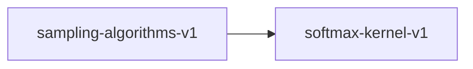

# sampling-algorithms-v1

**Version:** 1.0.0

Sampling algorithm invariants for autoregressive generation

## References

- Holtzman et al. (2019) The Curious Case of Neural Text Degeneration
- Qwen2.5-Coder Showcase Spec §14.5

## Dependencies

- [softmax-kernel-v1](softmax-kernel-v1.md)

## Dependency Graph

## Equations

### greedy

$$
greedy(logits) = argmax(logits)
$$

**Domain:** $logits \in \mathbb{R}^V (vocabulary logits)$

**Invariants:**

- $Returns index of maximum logit$
- $Deterministic: same input => same output$

### temperature

$$
softmax(logits / T)
$$

**Domain:** $logits \in \mathbb{R}^V, T > 0$

**Invariants:**

- $T=1 is identity: softmax(l/1) = softmax(l)$
- $T\to0 converges to argmax (one-hot)$
- $T\to∞ converges to uniform distribution$

### top_k

$$
top_k(probs, K) = {p_i if rank(p_i) <= K else 0, renormalized}
$$

**Domain:** $probs \in Δ^V (probability simplex), K \in [1, V]$

**Invariants:**

- $At most K tokens have non-zero probability$
- $Retained tokens have highest probabilities$

### top_p

$$
top_p(probs, p) = minimal set S where sum(S) >= p
$$

**Domain:** $probs \in Δ^V, p \in (0, 1]$

**Invariants:**

- $Cumulative probability of retained tokens >= p$
- $Set is minimal: removing any token drops below p$

## Proof Obligations

| # | Type | Property | Formal |
|---|------|----------|--------|
| 1 | equivalence | Greedy = argmax | $greedy(logits) == argmax(logits)$ |
| 2 | bound | Top-K cardinality | $count(nonzero(top_k(p, K))) <= K$ |
| 3 | bound | Top-P cumulative | $sum(top_p(p, threshold)) >= threshold$ |
| 4 | equivalence | Temperature identity | $softmax(l/1) == softmax(l)$ |
| 5 | equivalence | SIMD sampling equivalence |  |

## Falsification Tests

| ID | Rule | Prediction | If Fails |
|----|------|------------|----------|
| FALSIFY-SA-001 | Greedy = argmax | Greedy returns maximum logit index | Comparison or indexing error |
| FALSIFY-SA-002 | Top-K cardinality | At most K non-zero probabilities | Filtering or sorting error |
| FALSIFY-SA-003 | Top-P cumulative | Retained probabilities sum >= p | Cumulative sum tracking error |
| FALSIFY-SA-004 | Temperature identity | T=1 softmax matches raw softmax | Temperature division error |
| FALSIFY-SA-005 | SIMD sampling equivalence | SIMD sampling matches scalar |  compare scalar vs SIMD sampling:SIMD sampler selects different tokens |

## Kani Harnesses

| ID | Obligation | Bound | Strategy |
|----|------------|-------|----------|
| KANI-SA-001 | SA-EQ-001 | 8 | bounded_int |

## QA Gate

**Sampling Algorithms Contract** (F-SA-001)

Generation sampling quality gate

**Checks:** greedy_argmax, top_k_cardinality, top_p_cumulative, temperature_identity

**Pass criteria:** All 5 falsification tests pass

