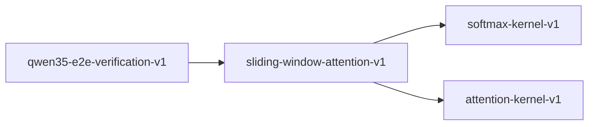

# sliding-window-attention-v1

**Version:** 1.0.0

Sliding window attention — bounded context for efficient long-sequence inference

## References

- Beltagy et al. (2020) Longformer: The Long-Document Transformer
- Jiang et al. (2023) Mistral 7B — Sliding Window Attention
- Qwen3.5 Technical Report — hybrid attention with window constraints

## Dependencies

- [softmax-kernel-v1](softmax-kernel-v1.md)
- [attention-kernel-v1](attention-kernel-v1.md)

## Dependency Graph

## Equations

### attention_sparsity

$$
sparsity = 1 - (sum(mask) / seq_len^2)
$$

**Domain:** $Fraction of zeroed attention weights$

**Invariants:**

- $sparsity \approx 1 - W/seq_len for large seq_len$
- $sparsity = 0 when W >= seq_len (dense attention)$

### causal_window_mask

$$
mask(i,j) = 1 if j <= i and i - j < W else 0
$$

**Domain:** $Causal (autoregressive) variant$

**Invariants:**

- $Strictly lower-triangular within window$
- $No future tokens: mask(i,j) = 0 for j > i$
- $At most min(i+1, W) attended positions for query i$

### effective_context

$$
ctx(i) = min(i + 1, W)
$$

**Domain:** $Number of tokens visible to position i$

**Invariants:**

- $ctx(0) = 1 (only self)$
- $ctx(i) = W for i >= W - 1$
- $Monotonically non-decreasing$

### multi_layer_receptive_field

$$
receptive(L) = 1 + L * (W - 1)
$$

**Domain:** $L layers of sliding window attention$

**Invariants:**

- $receptive(1) = W$
- $Monotonically increasing in L$
- $Full context reached when receptive(L) >= seq_len$

### window_mask

$$
mask(i,j) = 1 if |i - j| <= W/2 else 0
$$

**Domain:** $i,j \in [0, seq_len), W = window_size (even positive integer)$

**Invariants:**

- $Mask is symmetric: mask(i,j) = mask(j,i)$
- $Diagonal always attended: mask(i,i) = 1$
- $At most W attended positions per query$

## Proof Obligations

| # | Type | Property | Formal |
|---|------|----------|--------|
| 1 | invariant | Diagonal always attended | $\forall i: mask(i,i) = 1$ |
| 2 | invariant | Causal constraint | $\forall i,j: j > i \to mask(i,j) = 0$ |
| 3 | bound | Attention count bounded by window | $\forall i: sum_j(mask(i,j)) <= W$ |
| 4 | monotonicity | Effective context non-decreasing | $i < j \to ctx(i) <= ctx(j)$ |
| 5 | invariant | Sparsity zero for dense case | $W >= seq_len \to sparsity = 0$ |
| 6 | monotonicity | Receptive field grows with layers | $L1 < L2 \to receptive(L1) < receptive(L2)$ |
| 7 | conservation | Attention weight normalization within window | $\forall i: \|sum_j(attn(i,j)) - 1.0\| < \varepsilon where mask(i,j) = 1$ |

## Falsification Tests

| ID | Rule | Prediction | If Fails |
|----|------|------------|----------|
| FALSIFY-SWA-001 | Window symmetry (non-causal) | mask(i,j) = mask(j,i) | Off-by-one in window boundary |
| FALSIFY-SWA-002 | Causal masking | No future positions attended | Missing causal constraint |
| FALSIFY-SWA-003 | Effective context formula | ctx(i) = min(i+1, W) | Context count formula wrong |
| FALSIFY-SWA-004 | Dense degeneration | W >= seq_len produces full attention | Sparsity non-zero for dense window |
| FALSIFY-SWA-005 | Multi-layer receptive field | receptive(L) = 1 + L*(W-1) | Receptive field accumulation error |
| FALSIFY-SWA-006 | Attention normalization | Windowed softmax sums to 1 | Masked softmax not properly normalized |
| FALSIFY-SWA-007 | Attention count bounded | count(mask(i,:) == 1) <= W for all i | Window boundary off-by-one expands count |

## Kani Harnesses

| ID | Obligation | Bound | Strategy |
|----|------------|-------|----------|
| KANI-SWA-001 | SWA-INV-001 | 16 | bounded_int |
| KANI-SWA-002 | SWA-BND-001 | 16 | exhaustive |

## QA Gate

**Sliding Window Attention Contract** (F-SWA-001)

Window masking and sparsity quality gate

**Checks:** window_mask, causal_window_mask, effective_context, attention_sparsity, multi_layer_receptive_field

**Pass criteria:** All 7 falsification tests pass

