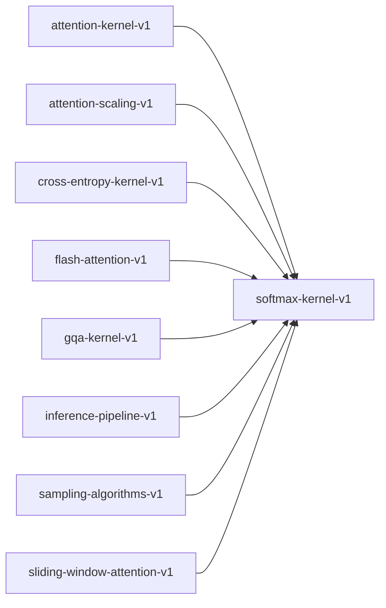

# softmax-kernel-v1

**Version:** 1.0.0

Softmax kernel — numerically stable exponential normalization

## References

- Bridle (1990) Training Stochastic Model Recognition Algorithms as Networks
- Milakov & Gimelshein (2018) Online normalizer calculation for softmax

## Dependency Graph

## Equations

### softmax

$$
\sigma(x)_i = \exp(x_i - max(x)) / \sum_j \exp(x_j - max(x))
$$

**Domain:** $x \in \mathbb{R}^n, n \geq 1$

**Codomain:** $\sigma(x) \in (0,1)^n$

**Invariants:**

- $\sum \sigma(x)_i = 1.0 (normalization)$
- $\sigma(x)_i > 0 for all i (strict positivity)$
- $argmax(\sigma(x)) = argmax(x) (order preservation)$

## Proof Obligations

| # | Type | Property | Formal |
|---|------|----------|--------|
| 1 | invariant | Output sums to 1 | $\|\sum \sigma(x)_i - 1.0\| < \varepsilon$ |
| 2 | invariant | All outputs strictly positive | $\sigma(x)_i > 0 for all i$ |
| 3 | bound | Each output bounded in (0,1) | $0 < \sigma(x)_i < 1 for all i$ |
| 4 | monotonicity | Order preservation | $x_i > x_j ⟹ \sigma(x)_i > \sigma(x)_j$ |
| 5 | equivalence | SIMD matches scalar within ULP |  |
| 6 | invariant | Translation invariance | $\sigma(x + c·1) = \sigma(x) for any scalar c$ |

## Kernel Phases

1. **find_max**: Compute max(x) for numerical stability — *max >= x_i for all i*
2. **exp_subtract**: Compute exp(x_i - max) for each element — *result_i ∈ (0, 1] for all i*
3. **sum_exp**: Compute Σ exp(x_i - max) — *sum > 0*
4. **normalize**: Divide each exp by sum — *output_i = exp_i / sum*

## SIMD Dispatch

| Kernel | ISA | Target |
|--------|-----|--------|
| softmax | avx2 | `softmax_avx2` |
| softmax | scalar | `softmax_scalar` |

## Falsification Tests

| ID | Rule | Prediction | If Fails |
|----|------|------------|----------|
| FALSIFY-SM-001 | Normalization | sum(softmax(x)) ≈ 1.0 for random x ∈ [-1000, 1000]^n | Missing or incorrect max-subtraction trick |
| FALSIFY-SM-002 | Positivity | softmax(x)_i > 0 for all i | exp underflow not handled |
| FALSIFY-SM-003 | Order preservation | argmax(softmax(x)) = argmax(x) | Numerical instability in subtraction |
| FALSIFY-SM-004 | SIMD equivalence | \|softmax_avx2(x) - softmax_scalar(x)\| < 8 ULP | SIMD reduction order differs from scalar |
| FALSIFY-SM-005 | Boundary - single element | softmax([x]) = [1.0] for any x | Edge case in loop bounds |
| FALSIFY-SM-006 | Boundary - identical elements | softmax([c,c,...,c]) = [1/n, 1/n, ..., 1/n] | Rounding error accumulation |

## Kani Harnesses

| ID | Obligation | Bound | Strategy |
|----|------------|-------|----------|
| KANI-SM-001 | SM-INV-001 | 8 | stub_float |
| KANI-SM-002 | SM-INV-002 | 8 | stub_float |
| KANI-SM-003 | SM-BND-001 | 8 | stub_float |

## QA Gate

**Softmax Contract** (F-SM-001)

Numerically stable softmax kernel quality gate

**Checks:** normalization, positivity, order_preservation, simd_equivalence

**Pass criteria:** All 6 falsification tests pass + Kani harnesses verify

