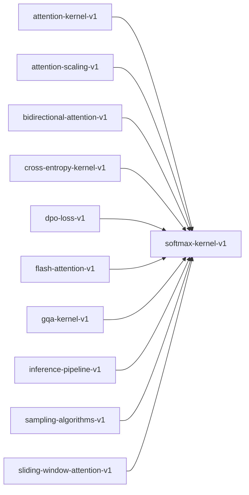

# softmax-kernel-v1

**Version:** 1.0.0

Softmax kernel — numerically stable exponential normalization

## References

- Bridle (1990) Training Stochastic Model Recognition Algorithms as Networks
- Milakov & Gimelshein (2018) Online normalizer calculation for softmax

## Dependency Graph

```mermaid
graph LR
    attention_kernel_v1["attention-kernel-v1"] --> softmax_kernel_v1["softmax-kernel-v1"]
    attention_scaling_v1["attention-scaling-v1"] --> softmax_kernel_v1["softmax-kernel-v1"]
    bidirectional_attention_v1["bidirectional-attention-v1"] --> softmax_kernel_v1["softmax-kernel-v1"]
    cross_entropy_kernel_v1["cross-entropy-kernel-v1"] --> softmax_kernel_v1["softmax-kernel-v1"]
    dpo_loss_v1["dpo-loss-v1"] --> softmax_kernel_v1["softmax-kernel-v1"]
    flash_attention_v1["flash-attention-v1"] --> softmax_kernel_v1["softmax-kernel-v1"]
    gqa_kernel_v1["gqa-kernel-v1"] --> softmax_kernel_v1["softmax-kernel-v1"]
    inference_pipeline_v1["inference-pipeline-v1"] --> softmax_kernel_v1["softmax-kernel-v1"]
    sampling_algorithms_v1["sampling-algorithms-v1"] --> softmax_kernel_v1["softmax-kernel-v1"]
    sliding_window_attention_v1["sliding-window-attention-v1"] --> softmax_kernel_v1["softmax-kernel-v1"]
```

## Equations

### softmax

$$
\sigma(x)_i = \exp(x_i - max(x)) / \sum_j \exp(x_j - max(x))
$$

**Domain:** $x \in \mathbb{R}^n, n \geq 1$

**Codomain:** $\sigma(x) \in (0,1)^n$

**Invariants:**

- $\sum \sigma(x)_i = 1.0 (normalization)$
- $\sigma(x)_i > 0 for all i (strict positivity)$
- $argmax(\sigma(x)) = argmax(x) (order preservation)$

## Proof Obligations

| # | Type | Property | Formal |
|---|------|----------|--------|
| 1 | precondition | Input vector is finite and non-empty | $\forall i: ¬isNaN(x_i) ∧ ¬isInf(x_i) ∧ len(x) > 0$ |
| 2 | postcondition | Output is a valid probability distribution | $len(\sigma(x)) = len(x) ∧ \forall i: 0 < \sigma(x)_i < 1 ∧ \|\sum \sigma(x)_i - 1\| < \varepsilon$ |
| 3 | frame | Only output buffer is modified; input vector unchanged | $modifies(output) ∧ preserves(input)$ |
| 4 | invariant | Output sums to 1 | $\|\sum \sigma(x)_i - 1.0\| < \varepsilon$ |
| 5 | invariant | All outputs strictly positive | $\sigma(x)_i > 0 for all i$ |
| 6 | bound | Each output bounded in (0,1) | $0 < \sigma(x)_i < 1 for all i$ |
| 7 | monotonicity | Order preservation | $x_i > x_j ⟹ \sigma(x)_i > \sigma(x)_j$ |
| 8 | equivalence | SIMD matches scalar within ULP |  |
| 9 | invariant | Translation invariance | $\sigma(x + c·1) = \sigma(x) for any scalar c$ |

## Kernel Phases

1. **find_max**: Compute max(x) for numerical stability — *max >= x_i for all i*
2. **exp_subtract**: Compute exp(x_i - max) for each element — *result_i ∈ (0, 1] for all i*
3. **sum_exp**: Compute Σ exp(x_i - max) — *sum > 0*
4. **normalize**: Divide each exp by sum — *output_i = exp_i / sum*

## SIMD Dispatch

| Kernel | ISA | Target |
|--------|-----|--------|
| softmax | avx2 | `softmax_avx2` |
| softmax | ptx | `softmax_ptx` |
| softmax | scalar | `softmax_scalar` |

## Falsification Tests

| ID | Rule | Prediction | If Fails |
|----|------|------------|----------|
| FALSIFY-SM-001 | Normalization | sum(softmax(x)) ≈ 1.0 for random x ∈ [-1000, 1000]^n | Missing or incorrect max-subtraction trick |
| FALSIFY-SM-002 | Positivity | softmax(x)_i > 0 for all i | exp underflow not handled |
| FALSIFY-SM-003 | Order preservation | argmax(softmax(x)) = argmax(x) | Numerical instability in subtraction |
| FALSIFY-SM-004 | SIMD equivalence | \|softmax_avx2(x) - softmax_scalar(x)\| < 8 ULP | SIMD reduction order differs from scalar |
| FALSIFY-SM-005 | Boundary - single element | softmax([x]) = [1.0] for any x | Edge case in loop bounds |
| FALSIFY-SM-006 | Boundary - identical elements | softmax([c,c,...,c]) = [1/n, 1/n, ..., 1/n] | Rounding error accumulation |
| FALSIFY-SM-007 | Precondition violation | softmax([]) panics or returns Err; softmax([NaN]) returns NaN | Missing input validation — kernel silently produces garbage |
| FALSIFY-SM-008 | Postcondition completeness | len(softmax(x)) = len(x) for all valid inputs | Output buffer allocation mismatch |
| FALSIFY-SM-009 | Frame condition | Input vector byte-identical before and after softmax call | Kernel corrupts input buffer (in-place mutation bug) |

## Kani Harnesses

| ID | Obligation | Bound | Strategy |
|----|------------|-------|----------|
| KANI-SM-001 | SM-INV-001 | 8 | stub_float |
| KANI-SM-002 | SM-INV-002 | 8 | stub_float |
| KANI-SM-003 | SM-BND-001 | 8 | stub_float |
| KANI-SOFTMA-004 | Input vector is finite and non-empty | 8 | exhaustive |
| KANI-SOFTMA-005 | Output is a valid probability distribution | 8 | exhaustive |
| KANI-SOFTMA-006 | Only output buffer is modified; input vector unchanged | 8 | exhaustive |
| KANI-SOFTMA-007 | Output sums to 1 | 8 | stub_float |
| KANI-SOFTMA-008 | All outputs strictly positive | 8 | exhaustive |
| KANI-SOFTMA-009 | Each output bounded in (0,1) | 8 | stub_float |
| KANI-SOFTMA-010 | Order preservation | 8 | exhaustive |
| KANI-SOFTMA-011 | SIMD matches scalar within ULP | 8 | exhaustive |
| KANI-SOFTMA-012 | Translation invariance | 8 | exhaustive |

## QA Gate

**Softmax Contract** (F-SM-001)

Numerically stable softmax kernel quality gate

**Checks:** normalization, positivity, order_preservation, simd_equivalence

**Pass criteria:** All 9 falsification tests pass + Kani harnesses verify

