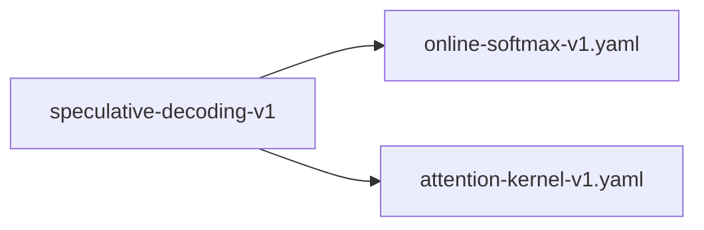

# speculative-decoding-v1

**Version:** 1.0.0

Speculative decoding with early-exit drafting — use shallow layers as draft model, verify in one batched full-depth pass (Leviathan et al. 2023, adapted for Whisper)

## References

- Leviathan, Kalman & Matias (2023) Fast Inference from Transformers via Speculative Decoding
- Chen, Borgeaud et al. (2023) Accelerating Large Language Model Decoding with Speculative Sampling
- Radford et al. (2023) Robust Speech Recognition via Large-Scale Weak Supervision (Whisper)

## Dependencies

- [online-softmax-v1.yaml](online-softmax-v1.yaml.md)
- [attention-kernel-v1.yaml](attention-kernel-v1.yaml.md)

## Dependency Graph



## Equations

### acceptance

```
Accept longest matching prefix plus one bonus token:
  n_match = max { n : y_draft[i] == y_verify[i] for all i in [0, n) }
  accepted_tokens = y_verify[0..n_match]  ∪  { y_verify[n_match] }
  num_accepted = n_match + 1
Cases:
  - All K match: accept K draft tokens + 1 bonus = K+1 tokens total
  - First mismatch at i=0: reject all drafts, accept y_verify[0] = 1 token
  - Mismatch at i=j (0 < j < K): accept j draft tokens + y_verify[j] bonus = j+1 tokens

```

**Domain:** $y_draft \in V^K, y_verify \in V^K$

**Codomain:** $num_accepted \in {1, 2, ..., K+1}$

**Invariants:**

- $num_accepted \geq 1 (at least the bonus token is always accepted)$
- $All accepted tokens are from y_verify (never from y_draft alone)$
- $Accepted prefix is consistent with full-model greedy decode$

### batched_verify

```
Full-depth batched verification of K draft tokens:
  X = [x_{t_0}, x_{t_0+1}, ..., x_{t_0+K-1}]  (K token embeddings, causal-masked)
  for l in 0..N_layers:
    X = DecoderLayer_l(X, encoder_out)          (batched, causal attention)
  y_verify[t_0..t_0+K-1] = argmax(LMHead(LayerNorm(X)), dim=-1)
Cost: 1 forward pass through all N_layers with batch size K.

```

**Domain:** $X \in \mathbb{R}^{K×d_model}, encoder_out \in \mathbb{R}^{S×d_model}$

**Codomain:** $y_verify \in V^K$

**Invariants:**

- $Verify uses all N_layers (no layer skipping)$
- $Causal mask ensures position i attends only to positions \leq i$
- $y_verify[i] is identical to sequential greedy decode at position t_0+i given same prefix$

### draft_decode

```
Early-exit draft using layers 0..D (D < N_layers):
  For t in [t_0, t_0+1, ..., t_0+K-1]:
    h_t = Embedding(y_{t-1}) + PositionalEncoding(t)
    for l in 0..D:
      h_t = DecoderLayer_l(h_t, encoder_out)
    y_draft[t] = argmax(LMHead(LayerNorm(h_t)))
Where D = 2, N_layers = 4, K = draft speculation length.

```

**Domain:** $y_{t-1} \in V (vocabulary), encoder_out \in \mathbb{R}^{S×d_model}, D \in {1,..,N_layers-1}, K \geq 1$

**Codomain:** $y_draft \in V^K$

**Invariants:**

- $D < N_layers (draft uses strict subset of layers)$
- $K \geq 1 (at least one candidate token drafted)$
- $Draft and full model share identical layer weights for layers 0..D$

### speedup_condition

```
Speculative decoding is faster when:
  E[num_accepted] * cost_full_sequential > cost_draft_K + cost_verify_batch
Where:
  cost_draft_K   = K * (D / N_layers) * cost_full_sequential   (K sequential shallow passes)
  cost_verify_batch ≈ cost_full_sequential * β(K)               (batched, β ≈ 1..2 for small K)
Simplifying, speedup > 1 when:
  E[num_accepted] > K * (D / N_layers) + β(K)
For D=2, N=4, K=5, β≈1.2: need E[num_accepted] > 5*(2/4) + 1.2 = 3.7 tokens/step.

```

**Domain:** $K \geq 1, D < N_layers, \beta \geq 1$

**Codomain:** $speedup \in \mathbb{R}+$

**Invariants:**

- $E[num_accepted] \geq 1 guarantees worst-case is bounded$
- `Speedup increases with acceptance rate α = P(draft == verify)`
- $For \alpha > D/N_layers, speculative decoding is always beneficial$

## Proof Obligations

| # | Type | Property | Formal |
|---|------|----------|--------|
| 1 | equivalence | Output tokens identical to non-speculative greedy decode | `speculative_decode(x) == greedy_decode(x) token-by-token for all inputs x` |
| 2 | invariant | Acceptance count lower bound | $num_accepted \geq 1 for every draft-verify step$ |
| 3 | invariant | Draft uses strict subset of layers | $draft_layers ⊂ full_layers, \|draft_layers\| = D < N_layers$ |
| 4 | invariant | Verify uses all layers | $\|verify_layers\| = N_layers, verify_layers = {0, 1, ..., N_layers-1}$ |
| 5 | invariant | Bonus token always accepted | `y_output includes y_verify[n_match] even when n_match = 0` |
| 6 | monotonicity | Acceptance rate monotonicity with draft quality | `If P_A(draft == verify) > P_B(draft == verify) then E_A[num_accepted] > E_B[num_accepted]` |
| 7 | invariant | Weight sharing between draft and verify | `draft.layer[l].params == verify.layer[l].params for all l in 0..D` |

## Kernel Phases

1. **draft_speculation**: Run K sequential forward passes through layers 0..D to produce K candidate tokens — *Each draft token uses only the first D layers; autoregressive dependency on previous draft tokens*
2. **batched_verification**: Run one batched forward pass through all N_layers with K positions, causal-masked — *Produces K logits identical to K sequential full-model passes given the same prefix*
3. **prefix_acceptance**: Compare draft vs verify tokens, find longest matching prefix, emit prefix + bonus — *num_accepted = (longest matching prefix length) + 1, always ≥ 1*
4. **state_advance**: Advance KV cache by num_accepted positions, set next input to last accepted token — *KV cache contains exactly the accepted prefix; no speculative state leaks into cache*

## Falsification Tests

| ID | Rule | Prediction | If Fails |
|----|------|------------|----------|
| FALSIFY-SPEC-001 | Output equivalence with greedy decode | speculative_decode(x) == greedy_decode(x) for all test inputs | Acceptance logic admits tokens not produced by full-model verify, or bonus token selection is incorrect |
| FALSIFY-SPEC-002 | Acceptance rate > 1.0 on typical English text | E[num_accepted] > 1.0 averaged over ≥100 English speech segments | Draft model (layers 0-1) has zero predictive power; early-exit representation is degenerate |
| FALSIFY-SPEC-003 | Single-token sequences handled correctly | Speculative decode produces correct output for sequences of length 1 (e.g., <\|endoftext\|> immediately) | Edge case in acceptance loop when all drafts rejected or sequence terminates before K tokens |
| FALSIFY-SPEC-004 | Draft-verify dimension consistency | LMHead(LayerNorm(h)) produces identical logit shape for D-layer and N-layer outputs | Layer norm or LM head expects full-depth residual stream statistics; early-exit hidden states have incompatible scale |
| FALSIFY-SPEC-005 | KV cache consistency after partial acceptance | After accepting n < K tokens, KV cache length == prefix_len + n and contains no speculative entries | Cache rollback logic retains speculative KV entries, corrupting subsequent decode steps |
| FALSIFY-SPEC-006 | Full-match bonus token correctness | When all K drafts match, the (K+1)-th bonus token equals greedy_decode at position t_0+K | Bonus token generated from stale logits or wrong position index |
| FALSIFY-SPEC-007 | Weight sharing between draft and verify | Property holds under boundary conditions | Edge case violation in Weight sharing between draft and verify |

## Kani Harnesses

| ID | Obligation | Bound | Strategy |
|----|------------|-------|----------|
| speculative-decoding-v1-kani-001 | Output tokens identical to non-speculative greedy decode | 8 | bounded_int |

