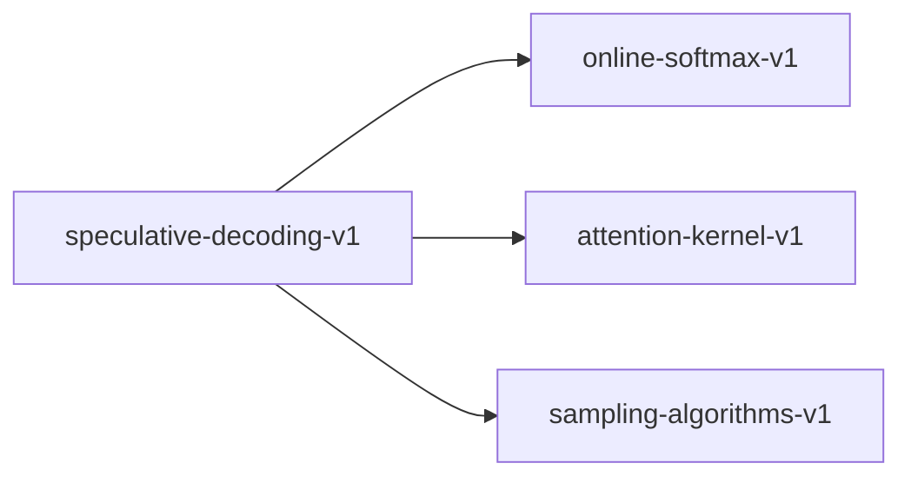

# speculative-decoding-v1

**Version:** 1.0.0

Speculative decoding — draft model generates candidate tokens, target model verifies in a single batched pass. Acceptance criterion preserves exact output distribution.

## References

- Leviathan, Kalman & Matias (2023) Fast Inference from Transformers via Speculative Decoding. ICML.
- Chen, Borgeaud et al. (2023) Accelerating Large Language Model Decoding with Speculative Sampling
- Stern, Shazeer et al. (2018) Blockwise Parallel Decoding for Deep Autoregressive Models

## Dependencies

- [online-softmax-v1](online-softmax-v1.md)
- [attention-kernel-v1](attention-kernel-v1.md)
- [sampling-algorithms-v1](sampling-algorithms-v1.md)

## Dependency Graph



## Equations

### acceptance_probability

$$
Acceptance probability for token x at position t:
  P(accept) = min(1, q(x) / p(x))
where:
  q(x) = target model probability for token x
  p(x) = draft model probability for token x
This is the standard rejection-sampling acceptance criterion
from Leviathan et al. (2023) Algorithm 1.

$$

**Domain:** $q(x) \in (0, 1], p(x) \in (0, 1] — both valid probabilities$

**Codomain:** $P(accept) \in (0, 1]$

**Invariants:**

- $P(accept) \in [0, 1] — valid probability$
- $P(accept) = 1 when q(x) >= p(x) — draft underestimates always accepted$
- $P(accept) = q(x)/p(x) when q(x) < p(x) — proportional rejection$

### output_equivalence

```
Output distribution equivalence:
  P_speculative(x_1, ..., x_n) = P_autoregressive(x_1, ..., x_n)
For each position, the marginal distribution of the accepted token
equals the target model distribution q(x), regardless of draft quality.
This holds because rejection sampling with acceptance ratio min(1, q/p)
and rejection resample from max(0, q-p) yields exact q distribution.

```

**Domain:** $x_i \in V (vocabulary), sequence of any length$

**Codomain:** $probability distribution over V^n$

**Invariants:**

- `Speculative output distribution == autoregressive output distribution (exact)`
- $Property holds for any draft model quality (even random draft)$
- $Expected speedup increases with draft-target agreement but correctness is unconditional$

### token_acceptance

$$
Token acceptance via uniform sampling:
  Draw u ~ Uniform(0, 1)
  Accept token x if u < P(accept) = min(1, q(x)/p(x))
  On rejection at position t, resample from adjusted distribution:
    r(x) = normalize(max(0, q(x) - p(x)))

$$

**Domain:** $u \in [0, 1], q(x) \in (0, 1], p(x) \in (0, 1]$

**Codomain:** $accept \in {true, false}$

**Invariants:**

- $Acceptance is a Bernoulli trial with parameter min(1, q/p)$
- $Adjusted distribution r(x) is a valid probability distribution (sums to 1)$
- $Rejection sampling preserves correctness — accepted tokens follow q(x)$

## Proof Obligations

| # | Type | Property | Formal |
|---|------|----------|--------|
| 1 | equivalence | Output distribution matches standard autoregressive | `P_spec(x_1..x_n) = P_auto(x_1..x_n) for all sequences and all draft models` |
| 2 | bound | Acceptance rate lower bound | $P(accept) >= 0 for all token probabilities q, p > 0$ |
| 3 | bound | Acceptance rate upper bound | $P(accept) <= 1 for all token probabilities q, p > 0$ |
| 4 | invariant | Adjusted distribution validity | $sum(max(0, q(x) - p(x))) > 0 when rejection occurs, and normalize(max(0, q-p)) sums to 1$ |
| 5 | monotonicity | Acceptance rate increases with draft quality | $E[accepted_tokens] increases as KL(p \|\| q) decreases$ |

## Kernel Phases

1. **draft_generation**: Draft model autoregressively generates K candidate tokens with probabilities p(x) — *Each p(x_t) is a valid probability distribution over vocabulary V*
2. **target_verification**: Target model computes q(x) for all K positions in a single batched forward pass — *Batched verification produces identical logits to sequential autoregressive decoding*
3. **acceptance_sampling**: For each position t=1..K, accept token if u_t < min(1, q(x_t)/p(x_t)) — *First rejection at position j means positions 1..j-1 accepted, position j resampled from max(0, q-p)*
4. **token_emission**: Emit accepted tokens plus one resampled or bonus token — *At least 1 token emitted per step; at most K+1 tokens emitted*

## Falsification Tests

| ID | Rule | Prediction | If Fails |
|----|------|------------|----------|
| FALSIFY-SD-001 | Output distribution equivalence | Over 10000 samples, KL divergence between speculative and autoregressive output < 0.01 | Acceptance criterion does not correctly implement rejection sampling; adjusted distribution r(x) miscalculated |
| FALSIFY-SD-002 | Acceptance probability bounds | min(1, q(x)/p(x)) ∈ [0, 1] for all valid probability pairs | Division by zero when p(x) = 0 or numerical overflow for extreme q/p ratios |
| FALSIFY-SD-003 | Adjusted distribution validity | sum(max(0, q(x) - p(x))) > 0 whenever a rejection occurs, and normalized distribution sums to 1 | q(x) <= p(x) for all x simultaneously (impossible when both are valid distributions), or normalization error |
| FALSIFY-SD-004 | At least one token per step | Speculative decoding emits >= 1 token per draft-verify cycle | Edge case where all K drafts rejected and bonus token not emitted |
| FALSIFY-SD-005 | Deterministic acceptance given fixed randomness | Given same u_t seeds, acceptance decisions are reproducible | Non-determinism from floating-point ordering or uninitialized state |

## Kani Harnesses

| ID | Obligation | Bound | Strategy |
|----|------------|-------|----------|
| KANI-SD-001 | Acceptance rate bounds | 16 | bounded_int |
| KANI-SD-002 | Token emission lower bound | 8 | bounded_int |
| KANI-SD-003 | Adjusted distribution non-negative | 8 | bounded_int |
| KANI-SPECUL-004 | Output distribution matches standard autoregressive | 8 | exhaustive |
| KANI-SPECUL-005 | Acceptance rate lower bound | 8 | stub_float |
| KANI-SPECUL-006 | Acceptance rate upper bound | 8 | stub_float |
| KANI-SPECUL-007 | Adjusted distribution validity | 8 | exhaustive |
| KANI-SPECUL-008 | Acceptance rate increases with draft quality | 8 | exhaustive |

## QA Gate

**Speculative Decoding Contract** (F-SD-001)

Rejection-sampling speculative decoding preserves exact target distribution

**Checks:** output_equivalence, acceptance_bounds, adjusted_distribution, min_token_emission

**Pass criteria:** All 5 falsification tests pass + 3 Kani harnesses verify

