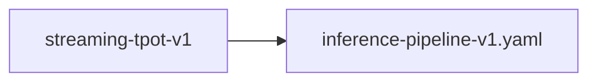

# streaming-tpot-v1

**Version:** 1.0.0

Benchmark client must support SSE streaming for TPOT measurement

## References

- qwen-coder-deploy bench-results-v2: TPOT 0.0ms everywhere — no streaming
- MLPerf Inference: TTFT and TPOT are mandatory metrics
- vLLM benchmarks: uses streaming for per-token timing
- probar loadtest.rs — current non-streaming client

## Dependencies

- [inference-pipeline-v1.yaml](inference-pipeline-v1.yaml.md)

## Dependency Graph

## Equations

### tpot_definition

$$
TPOT (Time Per Output Token):
  tpot_i = t(token_i) - t(token_{i-1})   for i > 1
  TTFT = t(token_1) - t(request_sent)     (first token)

Per-request TPOT:
  tpot_mean = (t(last_token) - t(first_token)) / (n_tokens - 1)

Relationship to end-to-end latency:
  latency = TTFT + (n_tokens - 1) × tpot_mean

SSE stream format (OpenAI compatible):
  data: {"choices":[{"delta":{"content":"token"}}]}

$$

**Domain:** $Streaming SSE responses, n_tokens \geq 2$

**Invariants:**

- $TTFT > 0 for valid responses$
- $TPOT \geq 0 for all tokens$
- $latency \approx TTFT + (n-1) × mean_TPOT$

## Proof Obligations

| # | Type | Property | Formal |
|---|------|----------|--------|
| 1 | invariant | TPOT computed from streaming data | $TPOT > 0 when server supports streaming and n_tokens > 1$ |
| 2 | bound | TTFT separable from TPOT | $TTFT / latency < 0.95 when streaming (proves streaming is active)$ |
| 3 | equivalence | Streaming output matches non-streaming | `concat(streaming_tokens) == non_streaming_response.content` |

## Falsification Tests

| ID | Rule | Prediction | If Fails |
|----|------|------------|----------|
| FALSIFY-ST-001 | TPOT non-zero | TPOT P50 > 0 when benchmarking a streaming-capable server | Client not sending stream:true or not parsing SSE |
| FALSIFY-ST-002 | TTFT separable | TTFT P50 < latency P50 × 0.5 for 128-token generation | TTFT includes full generation time — not measuring first token |
| FALSIFY-ST-003 | Content parity | Streaming and non-streaming produce identical output text | Streaming tokenization differs from batch response |

## Kani Harnesses

| ID | Obligation | Bound | Strategy |
|----|------------|-------|----------|
| KANI-ST-001 | TPOT computed from streaming data | 8 | bounded_int |
| KANI-ST-002 | TTFT separable from TPOT | 4 | stub_float |
| KANI-ST-003 | Streaming output matches non-streaming | 8 | bounded_int |

## QA Gate

**Streaming TPOT Measurement Contract** (F-ST-001)

SSE streaming support for per-token timing in benchmarks

**Checks:** tpot_nonzero, ttft_separable, content_parity

**Pass criteria:** All 3 falsification tests pass + TPOT P50 > 0

