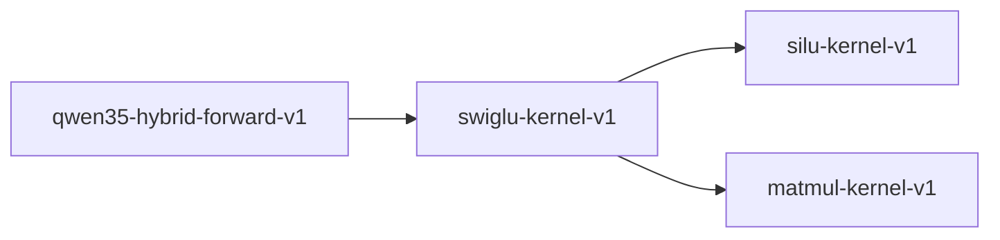

# swiglu-kernel-v1

**Version:** 1.0.0

SwiGLU kernel — gated linear unit with SiLU activation

## References

- Shazeer (2020) GLU Variants Improve Transformer
- Ramachandran et al. (2017) Searching for Activation Functions

## Dependencies

- [silu-kernel-v1](silu-kernel-v1.md)
- [matmul-kernel-v1](matmul-kernel-v1.md)

## Dependency Graph

## Equations

### silu

$$
SiLU(x) = x * sigmoid(x) = x / (1 + \exp(-x))
$$

**Domain:** $x in R$

**Codomain:** $SiLU(x) in (-0.279, +inf)$

**Invariants:**

- $SiLU(0) = 0$
- $SiLU(x) > -0.279 for all x (global minimum)$
- $SiLU is monotonic for x > 0$

### swiglu

$$
SwiGLU(x, W, V, b, c) = SiLU(xW + b) * (xV + c)
$$

**Domain:** $x in R^d, W in R^{d x h}, V in R^{d x h}, b in R^h, c in R^h$

**Codomain:** $SwiGLU(x) in R^h$

**Invariants:**

- $SwiGLU(0, W, V, 0, 0) = 0 (zero preservation)$
- $Decomposable as gate * value where gate = SiLU(xW+b)$

## Proof Obligations

| # | Type | Property | Formal |
|---|------|----------|--------|
| 1 | invariant | Zero preservation | $SwiGLU(0, W, V, 0, 0) = 0$ |
| 2 | equivalence | Fused matches unfused | $\|fused_swiglu(x) - (silu(xW+b) * (xV+c))\| < eps$ |
| 3 | bound | Gate output bounded below | $SiLU(xW+b)_i > -0.279 for all i$ |
| 4 | equivalence | SIMD matches scalar within ULP |  |

## Kernel Phases

1. **linear_gate**: Compute xW + b (gate projection) — *result has dimension h*
2. **linear_value**: Compute xV + c (value projection) — *result has dimension h*
3. **silu_activation**: Apply SiLU to gate: x * sigmoid(x) — *output_i > -0.279 for all i*
4. **elementwise_multiply**: Multiply SiLU(gate) * value element-wise — *output dimension equals h*

## SIMD Dispatch

| Kernel | ISA | Target |
|--------|-----|--------|
| swiglu | avx2 | `swiglu_avx2` |
| swiglu | scalar | `swiglu_scalar` |

## Falsification Tests

| ID | Rule | Prediction | If Fails |
|----|------|------------|----------|
| FALSIFY-SG-001 | Zero preservation | SwiGLU(0, W, V, 0, 0) = 0 for random W, V | Bias term incorrectly initialized or fused |
| FALSIFY-SG-002 | Fused equivalence | \|fused(x) - silu(xW+b)*(xV+c)\| < 1e-6 | Fusion optimization changed computation order |
| FALSIFY-SG-003 | SiLU lower bound | SiLU(z) > -0.279 for all z in [-1000, 1000] | Activation function has numerical instability |
| FALSIFY-SG-004 | SIMD equivalence | \|swiglu_avx2(x) - swiglu_scalar(x)\| < 8 ULP | SIMD reduction order or FMA differs from scalar |
| FALSIFY-SG-005 | Boundary - zero dimension | SwiGLU on empty input returns empty output | Edge case in dimension handling |
| FALSIFY-SG-006 | Monotonicity of gate | For fixed value, increasing gate input increases output when gate > 0 | SiLU monotonicity violated in positive domain |

## Kani Harnesses

| ID | Obligation | Bound | Strategy |
|----|------------|-------|----------|
| KANI-SG-001 | SG-INV-001 | 4 | stub_float |
| KANI-SG-002 | SG-EQV-001 | 4 | stub_float |
| KANI-SG-003 | SG-BND-001 | 8 | stub_float |

## QA Gate

**SwiGLU Contract** (F-SG-001)

Gated linear unit with SiLU activation quality gate

**Checks:** zero_preservation, fused_equivalence, silu_bound, simd_equivalence

**Pass criteria:** All 6 falsification tests pass + Kani harnesses verify

