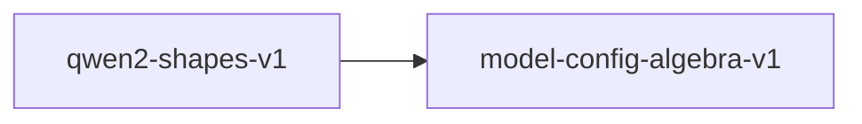

# qwen2-shapes-v1

**Version:** 1.0.0

Qwen2/2.5-7B concrete shape instantiation and RoPE frequency scaling

## References

- Qwen2.5 Technical Report — model configuration
- Su et al. (2021) RoFormer — Rotary Position Embedding

## Dependencies

- [model-config-algebra-v1](model-config-algebra-v1.md)

## Dependency Graph

## Equations

### head_dim_consistency

$$
d_k = hidden_size / num_attention_heads = 3584 / 28 = 128
$$

**Domain:** $Qwen2.5-7B config$

**Invariants:**

- $hidden_size is evenly divisible by num_attention_heads$
- $d_k = 128 (standard head dimension)$

### kv_projection_shape

$$
[n_kv * d_k, hidden] = [4*128, 3584] = [512, 3584]
$$

**Domain:** $Qwen2.5-7B config: n_kv=4, d_k=128$

**Invariants:**

- $GQA ratio: n_h / n_kv = 7$

### o_projection_transpose

$$
shape(o_proj) == transpose(shape(q_proj)) = [hidden, n_h * d_k]
$$

**Domain:** $Standard transformer$

**Invariants:**

- $O projection reverses Q projection dimensions$
- $For Qwen2.5-7B: [3584, 3584] (square, self-transpose)$

### q_projection_shape

$$
[n_h * d_k, hidden] = [28*128, 3584] = [3584, 3584]
$$

**Domain:** $Qwen2.5-7B config: n_h=28, d_k=128, hidden=3584$

**Invariants:**

- $Q projection is square for this config$

### rope_frequency

$$
freq_i = base^(-2i/d_k) for i in [0, d_k/2)
$$

**Domain:** $base = 1000000.0, d_k = 128$

**Invariants:**

- $len(freqs) = d_k / 2 = 64$
- $freq_0 = 1.0$
- $Strictly decreasing$

### swiglu_ratio

$$
intermediate / hidden = 18944 / 3584 = 37/7 \approx 5.286
$$

**Domain:** $Qwen2.5-7B config$

**Invariants:**

- $Expansion ratio is 37/7 (non-integer, divisible check: 18944 mod 3584 = 0 is false)$
- $gate_proj and up_proj both have shape [18944, 3584]$
- $down_proj has shape [3584, 18944]$

## Proof Obligations

| # | Type | Property | Formal |
|---|------|----------|--------|
| 1 | invariant | Q projection shape | $n_h * d_k = 3584 for Qwen2.5-7B$ |
| 2 | invariant | KV projection shape | $n_kv * d_k = 512 for Qwen2.5-7B$ |
| 3 | invariant | GQA divisibility | $n_h mod n_kv = 28 mod 4 = 0$ |
| 4 | invariant | SwiGLU gate/up shape | $gate_proj.shape = up_proj.shape = [18944, 3584]$ |
| 5 | invariant | O projection transpose | $shape(o_proj) == reverse(shape(q_proj))$ |
| 6 | invariant | RoPE frequency vector length | $len(freqs) == d_k / 2 = 64$ |
| 7 | monotonicity | RoPE frequency decreasing | $freq_i > freq_{i+1} for all i$ |
| 8 | invariant | Head dimension consistency | $3584 mod 28 = 0 and 3584 / 28 = 128$ |
| 9 | equivalence | SIMD shape equivalence |  |

## Falsification Tests

| ID | Rule | Prediction | If Fails |
|----|------|------------|----------|
| FALSIFY-QW2-001 | Q projection shape | n_h * d_k = 3584 for Qwen2.5-7B | n_h or d_k config constant wrong |
| FALSIFY-QW2-002 | KV projection shape | n_kv * d_k = 512 for Qwen2.5-7B | n_kv config constant wrong |
| FALSIFY-QW2-003 | GQA divisibility | 28 mod 4 = 0 | GQA ratio not integral |
| FALSIFY-QW2-004 | SwiGLU gate/up shape | gate_proj and up_proj are [18944, 3584] | FFN intermediate size wrong |
| FALSIFY-QW2-005 | O projection transpose | O shape is transpose of Q shape | O projection dimensions swapped |
| FALSIFY-QW2-006 | RoPE frequency vector length | len(freqs) == d_k / 2 = 64 | Off-by-one in frequency generation loop |
| FALSIFY-QW2-007 | RoPE frequency decreasing | freq_i > freq_{i+1} for all i | Exponent sign error in frequency formula |
| FALSIFY-QW2-008 | Head dimension consistency | 3584 / 28 = 128 exactly | hidden_size not divisible by num_attention_heads |
| FALSIFY-QW2-009 | SIMD shape equivalence | SIMD shapes match scalar shapes | SIMD implementation uses different dimensions |

## Kani Harnesses

| ID | Obligation | Bound | Strategy |
|----|------------|-------|----------|
| KANI-QW2-001 | QW2-INV-001 | 1 | exhaustive |

## QA Gate

**Qwen2/2.5 Shapes Contract** (F-QW2-001)

Model shape instantiation quality gate

**Checks:** q_projection, kv_projection, gqa_divisibility, swiglu_shapes, o_projection, rope_frequencies, head_dim_consistency

**Pass criteria:** All 9 falsification tests pass

