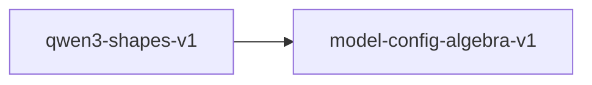

# qwen3-shapes-v1

**Version:** 1.0.0

Qwen3-8B concrete shape instantiation and RoPE frequency scaling

## References

- Qwen3 Technical Report — model configuration
- Su et al. (2021) RoFormer — Rotary Position Embedding

## Dependencies

- [model-config-algebra-v1](model-config-algebra-v1.md)

## Dependency Graph

## Equations

### head_dim_consistency

$$
d_k = hidden_size / num_attention_heads = 4096 / 32 = 128
$$

**Domain:** $Qwen3-8B config$

**Invariants:**

- $hidden_size is evenly divisible by num_attention_heads$
- $d_k = 128 matches explicit head_dim field$

### kv_projection_shape

$$
[n_kv * d_k, hidden] = [8*128, 4096] = [1024, 4096]
$$

**Domain:** $Qwen3-8B config: n_kv=8, d_k=128$

**Invariants:**

- $GQA ratio: n_h / n_kv = 4$

### o_projection_transpose

$$
shape(o_proj) == transpose(shape(q_proj)) = [hidden, n_h * d_k]
$$

**Domain:** $Standard transformer$

**Invariants:**

- $O projection reverses Q projection dimensions$
- $For Qwen3-8B: [4096, 4096] (square, self-transpose)$

### q_projection_shape

$$
[n_h * d_k, hidden] = [32*128, 4096] = [4096, 4096]
$$

**Domain:** $Qwen3-8B config: n_h=32, d_k=128, hidden=4096$

**Invariants:**

- $Q projection is square for this config$

### rope_frequency

$$
freq_i = base^(-2i/d_k) for i in [0, d_k/2)
$$

**Domain:** $base = 1000000, d_k = 128$

**Invariants:**

- $len(freqs) = d_k / 2 = 64$
- $freq_0 = 1.0$
- $Strictly decreasing$

### swiglu_ratio

$$
intermediate / hidden = 12288 / 4096 = 3.0
$$

**Domain:** $Qwen3-8B config$

**Invariants:**

- $Expansion ratio is exactly 3.0$
- $gate_proj and up_proj both have shape [12288, 4096]$
- $down_proj has shape [4096, 12288]$

## Proof Obligations

| # | Type | Property | Formal |
|---|------|----------|--------|
| 1 | invariant | Q projection shape | $n_h * d_k = 4096 for Qwen3-8B$ |
| 2 | invariant | KV projection shape | $n_kv * d_k = 1024 for Qwen3-8B$ |
| 3 | invariant | GQA divisibility | $n_h mod n_kv = 32 mod 8 = 0$ |
| 4 | invariant | SwiGLU expansion ratio | $12288 / 4096 = 3.0$ |
| 5 | invariant | O projection transpose | $shape(o_proj) == reverse(shape(q_proj))$ |
| 6 | invariant | RoPE frequency vector length | $len(freqs) == d_k / 2 = 64$ |
| 7 | monotonicity | RoPE frequency decreasing | $freq_i > freq_{i+1} for all i$ |
| 8 | invariant | Head dimension consistency | $4096 / 32 = 128 and matches explicit head_dim$ |
| 9 | equivalence | SIMD shape equivalence |  |

## Falsification Tests

| ID | Rule | Prediction | If Fails |
|----|------|------------|----------|
| FALSIFY-QW3-001 | Q projection shape | n_h * d_k = 4096 for Qwen3-8B | n_h or d_k config constant wrong |
| FALSIFY-QW3-002 | KV projection shape | n_kv * d_k = 1024 for Qwen3-8B | n_kv config constant wrong |
| FALSIFY-QW3-003 | GQA divisibility | 32 mod 8 = 0 | GQA ratio not integral |
| FALSIFY-QW3-004 | SwiGLU expansion ratio | intermediate / hidden = 3.0 | FFN intermediate size wrong |
| FALSIFY-QW3-005 | O projection transpose | O shape is transpose of Q shape | O projection dimensions swapped |
| FALSIFY-QW3-006 | RoPE frequency vector length | len(freqs) == d_k / 2 = 64 | Off-by-one in frequency generation loop |
| FALSIFY-QW3-007 | RoPE frequency decreasing | freq_i > freq_{i+1} for all i | Exponent sign error in frequency formula |
| FALSIFY-QW3-008 | Head dimension consistency | 4096 / 32 = 128 matches explicit head_dim | hidden_size not divisible by num_attention_heads |
| FALSIFY-QW3-009 | SIMD shape equivalence | SIMD shapes match scalar shapes | SIMD implementation uses different dimensions |

## Kani Harnesses

| ID | Obligation | Bound | Strategy |
|----|------------|-------|----------|
| KANI-QW3-001 | QW3-INV-001 | 1 | exhaustive |

## QA Gate

**Qwen3 Shapes Contract** (F-QW3-001)

Model shape instantiation quality gate

**Checks:** q_projection, kv_projection, gqa_divisibility, swiglu_ratio, o_projection, rope_frequencies, head_dim_consistency

**Pass criteria:** All 9 falsification tests pass

