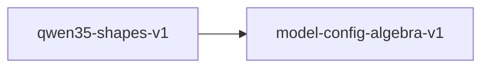

# qwen35-shapes-v1

**Version:** 1.0.0

Qwen3.5-9B concrete shape instantiation and RoPE frequency scaling

## References

- Qwen3.5 Fine-Tune Spec — model configuration
- Su et al. (2021) RoFormer — Rotary Position Embedding

## Dependencies

- [model-config-algebra-v1](model-config-algebra-v1.md)

## Dependency Graph

## Equations

### kv_projection_shape

$$
[n_kv * d_k, hidden] = [4*256, 4096] = [1024, 4096]
$$

**Domain:** $Qwen3.5-9B config: n_kv=4, d_k=256$

**Invariants:**

- $GQA ratio: n_h / n_kv = 4$

### o_projection_transpose

$$
shape(o_proj) == transpose(shape(q_proj)) = [hidden, n_h * d_k]
$$

**Domain:** $Standard transformer$

**Invariants:**

- $O projection reverses Q projection dimensions$

### q_projection_shape

$$
[n_h * d_k, hidden] = [16*256, 4096] = [4096, 4096]
$$

**Domain:** $Qwen3.5-9B config: n_h=16, d_k=256, hidden=4096$

**Invariants:**

- $Q projection is square for this config$

### rope_frequency

$$
freq_i = base^(-2i/d_k) for i in [0, d_k/2)
$$

**Domain:** $base = rope_theta, d_k = head_dim$

**Invariants:**

- $len(freqs) = d_k / 2$
- $freq_0 = 1.0$
- $Strictly decreasing$

### swiglu_ratio

$$
intermediate / hidden = 12288 / 4096 = 3.0
$$

**Domain:** $Qwen3.5-9B config$

**Invariants:**

- $Expansion ratio is exactly 3.0$

## Proof Obligations

| # | Type | Property | Formal |
|---|------|----------|--------|
| 1 | invariant | Q projection shape | $n_h * d_k = 4096 for Qwen3.5-9B$ |
| 2 | invariant | KV projection shape | $n_kv * d_k = 1024 for Qwen3.5-9B$ |
| 3 | invariant | SwiGLU expansion ratio | $12288 / 4096 = 3.0$ |
| 4 | invariant | O projection transpose | $shape(o_proj) == reverse(shape(q_proj))$ |
| 5 | invariant | RoPE frequency vector length | $len(freqs) == d_k / 2$ |
| 6 | monotonicity | RoPE frequency decreasing | $freq_i > freq_{i+1} for all i$ |
| 7 | equivalence | SIMD shape equivalence |  |

## Falsification Tests

| ID | Rule | Prediction | If Fails |
|----|------|------------|----------|
| FALSIFY-Q35-001 | Q projection shape | n_h * d_k = 4096 for Qwen3.5-9B | n_h or d_k config constant wrong |
| FALSIFY-Q35-002 | KV projection shape | n_kv * d_k = 1024 for Qwen3.5-9B | n_kv config constant wrong |
| FALSIFY-Q35-003 | SwiGLU expansion ratio | intermediate / hidden = 3.0 | FFN intermediate size wrong |
| FALSIFY-Q35-004 | O projection transpose | O shape is transpose of Q shape | O projection dimensions swapped |
| FALSIFY-Q35-005 | RoPE frequency vector length | len(freqs) == d_k / 2 = 128 | Off-by-one in frequency generation loop |
| FALSIFY-Q35-006 | RoPE frequency decreasing | freq_i > freq_{i+1} for all i | Exponent sign error in frequency formula |
| FALSIFY-Q35-007 | SIMD shape equivalence | SIMD shapes match scalar shapes | SIMD implementation uses different dimensions |

## Kani Harnesses

| ID | Obligation | Bound | Strategy |
|----|------------|-------|----------|
| KANI-Q35-001 | Q35-INV-001 | 1 | exhaustive |

## QA Gate

**Qwen3.5 Shapes Contract** (F-Q35-001)

Model shape instantiation quality gate

**Checks:** q_projection, kv_projection, swiglu_ratio, o_projection, rope_frequencies

**Pass criteria:** All 7 falsification tests pass

