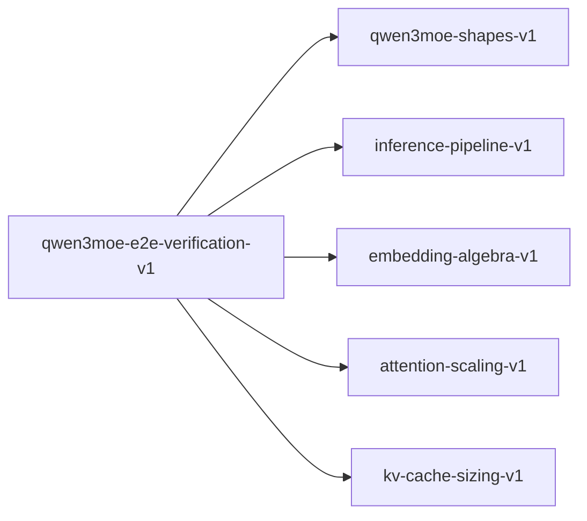

# qwen3moe-e2e-verification-v1

**Version:** 1.0.0

Qwen3-235B-A22B (MoE) end-to-end verification — composing all kernel contracts including MoE routing into a complete model proof

## References

- Qwen3 Technical Report — MoE architecture
- Vaswani et al. (2017) Attention Is All You Need
- Fedus et al. (2022) Switch Transformers — MoE scaling
- Su et al. (2021) RoFormer: Enhanced Transformer with Rotary Position Embedding

## Dependencies

- [qwen3moe-shapes-v1](qwen3moe-shapes-v1.md)
- [inference-pipeline-v1](inference-pipeline-v1.md)
- [embedding-algebra-v1](embedding-algebra-v1.md)
- [attention-scaling-v1](attention-scaling-v1.md)
- [kv-cache-sizing-v1](kv-cache-sizing-v1.md)

## Dependency Graph

## Equations

### active_parameter_count

$$
A = V*d + L*(d_attn + d_router + k*d_expert + d_norm) + d_final + V*d
$$

**Domain:** $k=8 active experts per token$

**Invariants:**

- $Active \approx 22.2B (A22B designation)$
- $Per-layer active MoE: 8 * 3 * 4096 * 1536 \approx 151.0M$
- $Active/Total ratio \approx 9.4\% (only 8/128 experts active)$

### contract_composition

$$
model = compose(embedding, L * moe_block, final_norm, lm_head)
$$

**Domain:** $Full model as composition of verified components$

**Invariants:**

- $Each component independently verified$
- $Composition preserves shape invariants$
- $Residual stream provides compositional proof structure$
- $94 identical MoE decoder blocks$
- $Each block: attention + MoE FFN (router + experts)$

### flops_per_token

$$
F \approx 2*A (forward pass) for active compute
$$

**Domain:** $Approximate FLOPs per token for autoregressive generation$

**Invariants:**

- $Linear in A (active params)$
- $Attention FLOP component is O(seq_len * d)$
- $GQA reduces KV computation by factor n_h/n_kv = 16$
- $MoE router adds O(d * N_experts) per token$

### memory_breakdown

$$
M = M_weights(total) + M_kv + M_activations
$$

**Domain:** $Total GPU memory during inference$

**Invariants:**

- $M_weights uses TOTAL params (all experts loaded)$
- $M_kv grows linearly with sequence length$
- $M_kv per layer = 2 * n_kv * d_k * seq_len * dtype_bytes$
- $M_activations bounded by batch_size * seq_len * d$

### model_parameter_count

$$
P = V*d + L*(d_attn + d_router + N_experts*d_expert + d_norm) + d_final + V*d
$$

**Domain:** $V=151936, d=4096, L=94, N_experts=128, moe_inter=1536$

**Invariants:**

- $Total \approx 235.1B for Qwen3-235B-A22B$
- $Embedding: 151936 * 4096 \approx 622.3M$
- $LM head (untied): 151936 * 4096 \approx 622.3M$
- $Per-layer attention: Q(33.6M) + K(2.1M) + V(2.1M) + O(33.6M) = 71.3M$
- $Per-layer MoE: 128 * 3 * 4096 * 1536 \approx 2415.9M$
- $Per-layer router: 4096 * 128 = 524K$
- $94 identical MoE decoder blocks (decoder_sparse_step=1)$

### throughput_model

$$
tok/s = min(bandwidth / bytes_per_token, compute / flops_per_token)
$$

**Domain:** $Roofline-limited throughput for MoE$

**Invariants:**

- $Memory-bound: must load ALL weights but only compute with 8 experts$
- $Bandwidth cost ∝ total params, compute cost ∝ active params$
- $MoE advantage: compute/memory ratio better than dense equivalent$

### verification_ladder

$$
coverage(contract_set) = verified_obligations / total_obligations
$$

**Domain:** $Fraction of proof obligations with passing tests or Kani proofs$

**Invariants:**

- $coverage in [0, 1]$
- $coverage = 1 means all obligations verified$

## Proof Obligations

| # | Type | Property | Formal |
|---|------|----------|--------|
| 1 | invariant | Total parameter count matches architecture | $P(Qwen3-235B) in [234B, 236B]$ |
| 2 | invariant | Active parameter count matches designation | $A(Qwen3-A22B) in [22B, 23B]$ |
| 3 | bound | FLOPs bounded by 2A | $F <= 2 * A + O(seq_len * d * L)$ |
| 4 | ordering | Quantization memory ordering | $M(Q4K) < M(Q6K) < M(F16) < M(F32)$ |
| 5 | monotonicity | Throughput increases with bandwidth | $bw1 < bw2 -> tok_s(bw1) <= tok_s(bw2)$ |
| 6 | invariant | Compositional proof structure | $for all l: shape(block_l(x)) = shape(x)$ |
| 7 | conservation | End-to-end shape: tokens in -> logits out | $shape(model(tokens)) = [seq_len, V]$ |

## Falsification Tests

| ID | Rule | Prediction | If Fails |
|----|------|------------|----------|
| FALSIFY-QM3E-001 | Total parameter count | Total params ≈ 235.1B | Architecture config mismatch or expert count wrong |
| FALSIFY-QM3E-002 | Active parameter count | Active params ≈ 22.2B with top-8 routing | Active expert count or routing config wrong |
| FALSIFY-QM3E-003 | FLOPs estimate | 2A FLOPs per forward token | Missing layer or expert in FLOP count |
| FALSIFY-QM3E-004 | Memory ordering | Q4K < Q6K < F16 < F32 memory | Quantization byte formula wrong |
| FALSIFY-QM3E-005 | Throughput roofline | tok/s bounded by bandwidth and compute | Roofline formula error |
| FALSIFY-QM3E-006 | Compositional proof structure | Each MoE block preserves shape | MoE block breaks shape invariant |
| FALSIFY-QM3E-007 | End-to-end shape conservation | tokens -> [seq_len, 4096] -> ... -> [seq_len, 151936] | Shape break in layer composition |

## Kani Harnesses

| ID | Obligation | Bound | Strategy |
|----|------------|-------|----------|
| KANI-QM3E-001 | QM3E-INV-001 | 1 | exhaustive |
| KANI-QM3E-002 | QM3E-ORD-001 | 4 | bounded_int |

## QA Gate

**Qwen3 MoE End-to-End Verification** (F-QM3E-001)

Full MoE model verification composition quality gate

**Checks:** total_parameter_count, active_parameter_count, flops_per_token, memory_breakdown, throughput_model, verification_ladder, contract_composition

**Pass criteria:** All 7 falsification tests pass + 100% obligation coverage

