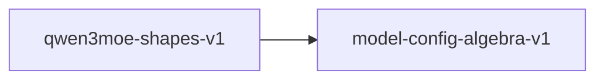

# qwen3moe-shapes-v1

**Version:** 1.0.0

Qwen3-235B-A22B (MoE) concrete shape instantiation, MoE routing, and RoPE frequency scaling

## References

- Qwen3 Technical Report — MoE architecture with top-8 routing
- Su et al. (2021) RoFormer — Rotary Position Embedding
- Fedus et al. (2022) Switch Transformers — MoE scaling

## Dependencies

- [model-config-algebra-v1](model-config-algebra-v1.md)

## Dependency Graph

## Equations

### kv_projection_shape

$$
[n_kv * d_k, hidden] = [4*128, 4096] = [512, 4096]
$$

**Domain:** $Qwen3-235B-A22B config: n_kv=4, d_k=128$

**Invariants:**

- $GQA ratio: n_h / n_kv = 64 / 4 = 16$
- $Aggressive GQA with 16:1 head ratio$

### moe_expert_shape

$$
expert_i: gate[moe_inter, hidden] * up[moe_inter, hidden] -> down[hidden, moe_inter]
$$

**Domain:** $128 experts, each with moe_intermediate_size=1536$

**Invariants:**

- $Each expert has 3 * hidden * moe_inter = 3 * 4096 * 1536 params$
- $Total expert params per layer = 128 * 3 * 4096 * 1536$
- $Active expert params per token = 8 * 3 * 4096 * 1536$

### moe_router_shape

$$
router: [num_experts, hidden] = [128, 4096]
$$

**Domain:** $Top-k routing with k=8$

**Invariants:**

- $Router selects top-8 of 128 experts per token$
- $norm_topk_prob normalizes selected expert weights$

### o_projection_transpose

$$
shape(o_proj) = [hidden, n_h * d_k] = [4096, 8192]
$$

**Domain:** $O projection contracts attention back to hidden dim$

**Invariants:**

- $O projection is contracting: [4096, 8192]$
- $shape(o_proj) == transpose(shape(q_proj))$

### q_projection_shape

$$
[n_h * d_k, hidden] = [64*128, 4096] = [8192, 4096]
$$

**Domain:** $Qwen3-235B-A22B config: n_h=64, d_k=128, hidden=4096$

**Invariants:**

- $Q projection is expanding (8192 > 4096) due to n_h*d_k > hidden$
- $Q output dim = 8192$

### rope_frequency

$$
freq_i = base^(-2i/d_k) for i in [0, d_k/2)
$$

**Domain:** $base = 1000000, d_k = 128$

**Invariants:**

- $len(freqs) = d_k / 2 = 64$
- $freq_0 = 1.0$
- $Strictly decreasing$

### swiglu_ratio

$$
moe_intermediate / hidden = 1536 / 4096 = 0.375
$$

**Domain:** $Per-expert SwiGLU ratio (compact experts)$

**Invariants:**

- $Per-expert expansion ratio 0.375 (sub-unity: compact experts)$
- $Effective expansion with 8 active: 8 * 1536 / 4096 = 3.0$

## Proof Obligations

| # | Type | Property | Formal |
|---|------|----------|--------|
| 1 | invariant | Q projection shape | $n_h * d_k = 8192 for Qwen3-235B-A22B$ |
| 2 | invariant | KV projection shape | $n_kv * d_k = 512 for Qwen3-235B-A22B$ |
| 3 | invariant | GQA divisibility | $n_h mod n_kv = 64 mod 4 = 0, ratio = 16$ |
| 4 | invariant | MoE expert shape | $each expert: 3 * 4096 * 1536 params$ |
| 5 | invariant | MoE router top-k | $router selects exactly 8 of 128 experts$ |
| 6 | invariant | O projection transpose | $shape(o_proj) == reverse(shape(q_proj))$ |
| 7 | monotonicity | RoPE frequency decreasing | $freq_i > freq_{i+1} for all i$ |
| 8 | equivalence | SIMD shape equivalence |  |

## Falsification Tests

| ID | Rule | Prediction | If Fails |
|----|------|------------|----------|
| FALSIFY-QM3-001 | Q projection shape | n_h * d_k = 8192 for Qwen3-235B-A22B | n_h or d_k config constant wrong |
| FALSIFY-QM3-002 | KV projection shape | n_kv * d_k = 512 for Qwen3-235B-A22B | n_kv config constant wrong |
| FALSIFY-QM3-003 | GQA divisibility | 64 mod 4 = 0, ratio = 16 | GQA ratio not integral |
| FALSIFY-QM3-004 | MoE expert shape | per-expert params = 3 * 4096 * 1536 = 18874368 | Expert intermediate size wrong |
| FALSIFY-QM3-005 | MoE router top-k | top_k=8 selects 8 of 128 experts | Router k exceeds num_experts |
| FALSIFY-QM3-006 | O projection transpose | O shape [4096, 8192] is transpose of Q shape [8192, 4096] | O projection dimensions wrong |
| FALSIFY-QM3-007 | RoPE frequency decreasing | freq_i > freq_{i+1} for all i | Exponent sign error in frequency formula |
| FALSIFY-QM3-008 | SIMD shape equivalence | SIMD shapes match scalar shapes | SIMD implementation uses different dimensions |

## Kani Harnesses

| ID | Obligation | Bound | Strategy |
|----|------------|-------|----------|
| KANI-QM3-001 | QM3-INV-001 | 1 | exhaustive |

## QA Gate

**Qwen3 MoE Shapes Contract** (F-QM3-001)

MoE model shape instantiation quality gate

**Checks:** q_projection, kv_projection, gqa_divisibility, moe_expert_shape, moe_router, o_projection, rope_frequencies

**Pass criteria:** All 8 falsification tests pass

